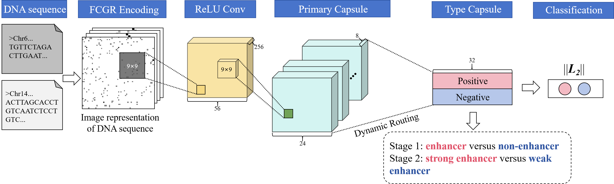

# CapsEnhencer

**A model for enhanced classification and feature extraction**


## Abstract

Enhancers are a class of non-coding DNA, serving as crucial regulatory elements in governing gene expression by binding to transcription factors. The identification of enhancers holds paramount importance in the field of biology. However, traditional experimental methods for enhancer identification demand substantial human and material resources. Consequently, there is a growing interest in employing computational methods for enhancer prediction. In this study, we propose a two-stage framework based on deep learning, termed CapsEnhancer, for the identification of enhancers and their strengths. CapsEnhancer utilizes chaos game representation to encode DNA sequences into unique images and employs a capsule network to extract local and global features from sequence ”images”. Experimental results demonstrate that CapsEnhancer achieves state-of-the-art performance in both stages. In the first and second stages, the accuracy surpasses the previous best methods by 8% and 3.5%, reaching accuracies of 94.5% and 95%, respectively. Notably, this research represents the pioneering application of computer vision methods to enhancer identification tasks. We believe that this study not only contributes novel insights to enhancer identification but also provides a fresh perspective for other biological sequence analysis tasks.


### Dataset
**Download form ：[https://nsclbio.jbnu.ac.kr/tools/iEnhancer-RF/](https://academic.oup.com/bioinformatics/article/34/22/3835/5034432)‘s Supplementary data**

**Train dataset: [Supplementary data S1](https://oup.silverchair-cdn.com/oup/backfile/Content_public/Journal/bioinformatics/34/22/10.1093_bioinformatics_bty458/2/bioinformatics_34_22_3835_s4.pdf?Expires=1706160062&Signature=iPxHDER3J~ISQkFLpRVCHdE~x4y6QpxwdYLeIBDhLX~qjCRWgMGVX6oD7NYN9gWT9caFOh6lbCcrd16Qd4cUMtkj8ivvWS4r~wF~LqbvcxPqd3Bh2IB~bixe~wGUrpat2dztTPQkXh6bCoN2-7VaCilwRaVQXkDrkcqcJewoeJ2hIWzDx38SMC1zfALVlpcjbN2Jkm7nwb5u8TW5eSRTYxa29fuIBFgQFOHb52P2gvjBB~XQapP87LxdNjnN7rItYiJhrGtGvfInTDdnGFbpDVWXqr-r9qgnuOmHTDewmavSx9HN9knCXYqvFllDT2x5Bodq-mMPylOjUjXJYe~Qlw__&Key-Pair-Id=APKAIE5G5CRDK6RD3PGA)**

**Test dataset:[Supplementary data S1](https://oup.silverchair-cdn.com/oup/backfile/Content_public/Journal/bioinformatics/34/22/10.1093_bioinformatics_bty458/2/bioinformatics_34_22_3835_s7.pdf?Expires=1706160062&Signature=PjyzmSNIFcaXtCD71nifE4uYLVyIOjAtk-jMpwVBT4r9vQYSuVglz1ykZ~G50tayf8gzvWEkOC3JZUc75t8tc4nBKwDxnB~t8-4cwAtEGhNAWreIuBvIKkthqg7KJym0E8Zig38zvAyNB70qsXoB7wDPUnL2Mswg4fRCVeCrA7bqx9iuUYoTKalGD3osRxxglO~zm80d7DWlhsxFxgFPIuwmxgKhGl20LaMAQkPqkvLl1HQzhOHaZIVebE9N2HvGmvZJL3TEmiCtWK6EmbCbrHmBw4ZnjEBfYFB3xaOHdlflYtUzh1qstoeujUK4Re-CKXyA0GbKUG~Ob-Rjem0lVw__&Key-Pair-Id=APKAIE5G5CRDK6RD3PGA)**

### Model



## 1.Train

```shell
python3 train.py
```

**please make sure that cuda is avaliable**


## 2.Evaluate

```
python3 evaluate.py
```

**please make sure that cuda is avaliable again**


## 3. train dataset

```
vi train.py
```

**please edit below sentences**

```
...
fig = pd.read_csv("data/stage1/Train.txt")
...
fig_test = pd.read_csv("data/stage1/Test.txt")
```

 **If you want to use our model to train other DNA-related data, please use the data processing code (CGR Encoding) we provide to ensure that the shape of the data matches our model** 


## CGR Encoding

**This instruction can encode DNA sequences into 2D images.**

**Instruction format:**

```shell
Rscript generate_cgr.R {file name} DNA {resolution}
file name: CSV file path, please note that it does not include ". csv".
resolution: The resolution of the generated image.
output: The output is a. txt format file that describes the generated DNA "image".
```


**For example:**

```shell
 Rscript generate_cgr.R dataset/stage1/Test DNA 64
```

